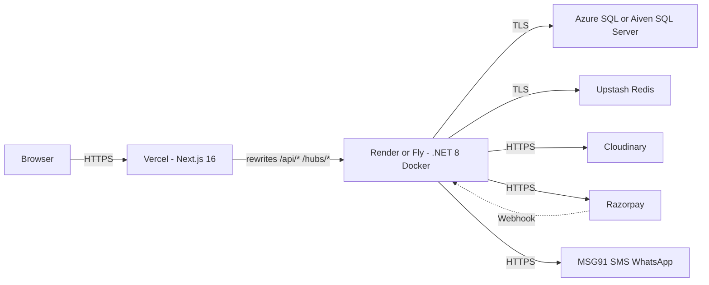

# FirstCry — Quick Commerce Platform

A full-stack quick-commerce / baby-products e-commerce platform built on **ASP.NET Core 8** (Clean Architecture + CQRS) and **Next.js 16** (App Router + Zustand), with OTP authentication, Razorpay payments, an admin back office, and managed-PaaS-ready Docker images.

> Status: **Beta / MVP** — feature-complete for browsing, OTP login, cart, checkout, payments, and admin ops. Hardened for managed-PaaS deployment (Vercel + Render/Fly). See [SECURITY_CHECKLIST.md](SECURITY_CHECKLIST.md) before going live.

---

## 1. Tech Stack

| Layer | Technology |
|---|---|
| **Frontend** | Next.js 16, React 19, TailwindCSS v4, Zustand, TanStack Query, Framer Motion, Recharts |
| **Backend** | ASP.NET Core 8 (C#), Clean Architecture, MediatR (CQRS), FluentValidation, Serilog |
| **Database** | Microsoft SQL Server (Azure SQL / Aiven recommended in prod) |
| **ORM** | Entity Framework Core 8 + Migrations |
| **Cache / OTP store** | Redis (optional — graceful in-memory fallback) |
| **Search** | SQL `LIKE` (Meilisearch config present, not wired) |
| **Realtime** | SignalR (with optional Redis backplane) |
| **Storage** | Cloudinary (optional — falls back to local API server) |
| **Payments** | Razorpay (live + demo mode) |
| **OTP** | MSG91 SMS / WhatsApp (live + demo console mode) |
| **DevOps** | Docker (multi-stage), Docker Compose, GitHub Actions |

---

## 2. Repository Layout

```
firstcry/
├── frontend/                          → Next.js 16 storefront + /admin
│   ├── src/app/                       → App Router pages (storefront, account, admin)
│   ├── src/components/                → Feature-oriented React components
│   ├── src/stores/                    → Zustand stores (auth, cart, ui, location)
│   ├── src/lib/api/                   → Axios client + endpoints
│   ├── src/middleware/                → AuthGuard / AdminGuard / GuestGuard
│   ├── middleware.js                  → Next.js Edge middleware (route protection)
│   └── next.config.mjs                → Rewrites /api/* and /hubs/* to the backend
│
├── backend/FirstCry/src/
│   ├── FirstCry.Domain/               → Entities, enums, domain events
│   ├── FirstCry.Application/          → MediatR commands/queries, DTOs, interfaces
│   ├── FirstCry.Infrastructure/       → EF Core, repos, auth, payments, SMS, cache
│   └── FirstCry.API/                  → Controllers, middleware, SignalR hubs
│
├── docker/                            → Multi-stage Dockerfiles
├── docker-compose.yml                 → Dev infra (SQL Server, Redis, Meilisearch)
├── docker-compose.prod.yml            → Production-style compose for single-VM hosts
├── .github/workflows/                 → CI (build + warn-only vulnerability scan)
├── tools/                             → Admin/user reset console apps (optional)
├── DEPLOYMENT.md                      → Deployment guide
├── INTEGRATIONS.md                    → API-key checklist
└── SECURITY_CHECKLIST.md              → Pre-deploy security + smoke test list
```

---

## 3. Architecture

### 3.1 High-level topology (target deployment)



### 3.2 Backend — Clean Architecture

| Layer | Project | Responsibility |
|---|---|---|
| **API** | `FirstCry.API` | Controllers, middleware, SignalR hubs, JWT/CORS/rate limiting, Serilog |
| **Application** | `FirstCry.Application` | MediatR commands/queries, DTOs, FluentValidation pipeline, interfaces |
| **Domain** | `FirstCry.Domain` | Entities, enums, domain events, `AuditableEntity`, `BaseEntity` |
| **Infrastructure** | `FirstCry.Infrastructure` | EF Core context, repositories, auth, Razorpay, MSG91, Cloudinary, cache |

**Patterns used:** Clean Architecture, CQRS (via MediatR), Unit of Work / Repository, Owned Entities (`RefreshToken`), Global Query Filters (soft delete), Auditable Entities.

### 3.3 Frontend — Next.js App Router

- **App Router** (`frontend/src/app/`) for storefront, account, checkout, admin
- **Zustand** for client state (`auth-store`, `cart-store`, `ui-store`, `location-store`) with `persist` middleware
- **TanStack Query** for server data on selected hot paths
- **Same-origin API access** via `next.config.mjs` rewrites — `/api/*` → backend, `/hubs/*` → SignalR
- **Two protection layers** for routes:
  1. `frontend/middleware.js` (Edge) — JWT parse + cookie-based gate
  2. `AuthGuard` / `AdminGuard` components — hydration-aware client gate

---

## 4. Feature Map

### 4.1 Public storefront

- Home with hero, categories, featured/trending products
- Category and sub-category pages, product detail (`/products/[slug]`)
- Search (SQL `LIKE` against name, description, tag)
- Wishlist, account, addresses, order history
- Cart (guest + authenticated, with merge-on-login)
- Checkout flow: Cart → Address → Payment → Confirmation
- Razorpay checkout (live) or demo modal (when keys missing)

### 4.2 Authentication

| Step | Endpoint |
|---|---|
| Request OTP (SMS or WhatsApp) | `POST /api/v1/auth/send-otp` |
| Verify OTP, get JWT + refresh cookie | `POST /api/v1/auth/verify-otp` |
| Rotate refresh token | `POST /api/v1/auth/refresh-token` |
| Revoke refresh token | `POST /api/v1/auth/logout` |
| Get current user | `GET /api/v1/auth/me` |

**Notes**

- **Custom user model** — not ASP.NET Identity. `User.Role` is a plain string (`"User"` / `"Admin"`).
- **OTP store** — Redis if available, in-memory `IMemoryCache` fallback.
- **Refresh tokens** are `[Owned]` on `User`, with rotation + 5-token limit + IP audit.
- **Rate limit** — 5 requests / minute on auth endpoints.
- **JWT claims** — `sub`, `phone`, `role`, `isGuest`, `profileCompleted`.

### 4.3 Admin back office (`/admin/*`)

- Dashboard with KPIs (revenue, orders, customers, low stock)
- Product CRUD + image upload, stock updates, toggle active
- Order management with status timeline and history
- Customers list (block/unblock)
- Categories, brands, coupons, banners, reviews, inventory, analytics
- Server-side policy: `[Authorize(Policy = "AdminOnly")]` — accepts `admin` / `Admin` case-insensitively
- Client-side policy: `AdminGuard` (hydration-aware)

### 4.4 Payments

- **Razorpay** order creation, signature verification, webhook handling, refund support
- **Demo mode** activates automatically when keys are blank — no real charges
- Webhook URL: `POST /api/v1/payments/webhook` (register in Razorpay dashboard)

### 4.5 Real-time

- `NotificationHub` (`/hubs/notifications`) with SignalR
- Optional Redis backplane for multi-instance scale (auto-detected at startup)

---

## 5. API Surface (v1)

| Controller | Purpose |
|---|---|
| `AuthController` | OTP send/verify, refresh, logout, profile |
| `ProductsController` | Public catalog reads + admin writes |
| `CategoriesController` / `BrandsController` | Catalog meta |
| `CartController` | Server-side cart for authenticated users |
| `OrdersController` | Place / view / cancel |
| `PaymentsController` | Razorpay order, verify, webhook, refund |
| `WishlistController` | User wishlist |
| `ReviewsController` | Product reviews |
| `UsersController` | Profile, addresses |
| `AdminController` | Dashboard, products, orders, customers (AdminOnly) |
| `AnalyticsController` | Admin analytics |
| `SearchController` | SQL search |
| `MediaController` | Cloudinary uploads / local fallback |
| `InventoryController` / `WarehouseController` / `ShippingController` / `DeliveryController` | Ops scaffolding |
| `IntegrationsController` | `/api/v1/integrations` — live/demo status snapshot |
| `HealthController` | `/health` with DB probe |

URL versioning: `/api/v{version:apiVersion}/...` — currently `v1.0`.

---

## 6. Quick Start

### 6.1 Prerequisites

- **Node.js 22+**
- **.NET 8 SDK** (verified: this project targets `net8.0`)
- **Docker Desktop** (for infra and prod-style compose)
- **SQL Server** locally, via Docker, or LocalDB

### 6.2 Local dev (no Docker)

```powershell
# 1. Start LocalDB (if you prefer it over Docker SQL)
sqllocaldb start MSSQLLocalDB

# 2. Backend
cd backend/FirstCry/src/FirstCry.API
dotnet run --urls http://localhost:5181

# 3. Frontend (in a separate terminal)
cd frontend
npm install
npm run dev
```

The frontend dev server proxies `/api/*` to `http://localhost:5181` via `next.config.mjs`.

### 6.3 Local dev (with Docker infra)

```bash
# Start SQL Server + Redis + Meilisearch only
docker compose up -d sqlserver redis meilisearch

# Then run backend + frontend as above
```

### 6.4 Production-style local run (full Docker)

```bash
cp .env.example .env
# Fill in JWT_SECRET, MSSQL_SA_PASSWORD, ALLOWED_ORIGINS, etc.

docker compose -f docker-compose.prod.yml up -d --build
```

| Service | URL |
|---|---|
| Frontend | http://localhost:3000 |
| Backend  | http://localhost:5000 |
| Health   | http://localhost:5000/health |

### 6.5 Environment templates

- Backend env-var contract: see `.env.example` and [INTEGRATIONS.md](INTEGRATIONS.md)
- Frontend (Vercel-ready): see `frontend/.env.local.example`

---

## 7. Deployment Targets

This project is built for **managed PaaS**:

| Component | Recommended | Alternative |
|---|---|---|
| Frontend | **Vercel** (auto-detects Next.js) | Netlify, Render Static, Cloudflare Pages |
| Backend  | **Render** (Docker) or **Fly.io** | Azure App Service, AWS App Runner, ECS |
| Database | **Azure SQL Basic** ($5/mo) | Aiven SQL Server, RDS |
| Redis    | **Upstash** (free tier) | Render Redis, Azure Cache, Elasticache |
| Media    | **Cloudinary** | S3 + CloudFront |
| Payments | **Razorpay** | Stripe (would need adapter) |
| OTP      | **MSG91** SMS + WhatsApp | Twilio (would need adapter) |

> **Important for Vercel/Render builds:** the frontend `dev` / `build` / `start` scripts use **`cross-env`** (cross-platform) — Windows-only `set NODE_OPTIONS=...` would break the Linux build host.

See [DEPLOYMENT.md](DEPLOYMENT.md) for the step-by-step deployment guide and [SECURITY_CHECKLIST.md](SECURITY_CHECKLIST.md) for the pre-launch security and smoke-test list.

---

## 8. Engineering Analysis (Senior Review)

### 8.1 Strengths

- **Clean Architecture** with proper layer separation and DI registration
- **CQRS with MediatR** + a FluentValidation pipeline behavior
- **Resilient external services** — Redis, MSG91, Razorpay, Cloudinary all have graceful demo / fallback modes; startup never fails because an optional dependency is unreachable
- **JWT secret guardrails** — `JwtConfigurationExtensions` rejects placeholders and short secrets in non-Development environments
- **Rate limiting** — 5/min on auth, 100/min default
- **Security headers + HSTS** outside Development, forwarded-headers configured for reverse proxies
- **Soft delete** global query filter on every `AuditableEntity`
- **EF Core retry on transient SQL failures** (3 retries, 10 s backoff)
- **Multi-stage Dockerfiles** with non-root users and `output: standalone` Next.js builds
- **Healthcheck endpoint** that returns 503 with a useful payload when the DB is down — load balancers route correctly
- **Comprehensive admin panel** wired through `[Authorize(Policy = "AdminOnly")]` + `AdminGuard`

### 8.2 Known limitations (intentional trade-offs)

| Area | Limitation | Why it's OK for now |
|---|---|---|
| Auth | Custom `User.Role` string, not ASP.NET Identity | Simpler and sufficient for two roles |
| Tokens | Access token in localStorage + non-HttpOnly cookie | Required by the current client-side store; planned hardening in [SECURITY_CHECKLIST.md](SECURITY_CHECKLIST.md) §6 |
| Search | SQL `LIKE` on Products | Fine for thousands of SKUs; swap to Meilisearch when needed |
| Domain events | Raised but not dispatched through a handler | No active consumers yet |
| Tests | No automated tests | Documented as a follow-up; high-priority next step |
| `typescript.ignoreBuildErrors` | `true` in `next.config.mjs` | Avoids surprise build failures during first deploy |
| CSRF | No anti-CSRF tokens | Acceptable for JSON APIs called from same-origin Next.js; revisit if exposing form-encoded endpoints |

### 8.3 Things this project does NOT do

- Does not use ASP.NET Identity / `UserManager` / `RoleManager`
- Does not run Meilisearch as the search backend (only configured)
- Does not auto-deploy on push — Vercel / Render do that via their own integrations
- Does not include unit, integration, or e2e tests

### 8.4 Deployment readiness rating

**Overall: 7.5 / 10** for a managed-PaaS beta launch after the pre-deploy hardening in this repo is applied.

| Dimension | Score | Notes |
|---|---|---|
| Code architecture | 8.5 / 10 | Clean + CQRS, consistent layering |
| Containerization | 8 / 10 | Multi-stage, non-root, `.dockerignore` in place |
| Configuration / secrets | 8 / 10 | `.env` is gitignored (verified untracked); env-var-only in prod |
| Auth & security | 6 / 10 | JWT solid, refresh rotation good; localStorage trade-off documented |
| Database / data layer | 6 / 10 | EF retries + soft delete; indexes pending |
| Observability | 6 / 10 | Serilog file+console; no APM yet |
| Resilience | 7.5 / 10 | Graceful fallbacks throughout |
| Frontend deploy | 8 / 10 | `cross-env` fix means Vercel build works on first try |
| CI/CD | 6 / 10 | Build + warn-only vuln scan; deploy via PaaS integrations |
| Tests | 1 / 10 | Not present — biggest gap |

---

## 9. What Changed for PaaS Readiness

Recent pre-deploy hardening (no business-logic changes):

| Change | File | Why |
|---|---|---|
| Cross-platform Node memory flags | `frontend/package.json` | Linux build hosts (Vercel/Render) cannot use Windows `set NODE_OPTIONS=...` |
| `cross-env` added as devDep | `frontend/package.json` | Enables the above |
| `.dockerignore` at repo root | `.dockerignore` | Shrinks backend image, prevents leaking `.env`, `docs/`, `tools/`, agent dirs |
| JWT `ClockSkew` tightened to 30 s | `backend/FirstCry/src/FirstCry.API/Program.cs` | Was 5 min; refresh rotation already handles legitimate "just expired" UX |
| CI vuln scans (warn-only) | `.github/workflows/ci.yml` | `npm audit` + `dotnet list package --vulnerable` |
| `.gitignore` hardening | `.gitignore` | Prevents agent / IDE / runtime-log clutter from returning |
| Build artifacts and stale files removed | repo root | `node_modules`, `.next`, `bin/`, `obj/`, `runtime-logs/`, `.minimax/`, `.opencode/`, `.mavis/`, `scratchpad.md`, audit reports, loose SQL |
| Security checklist | `SECURITY_CHECKLIST.md` | Sign-off list + smoke tests before launch |

---

## 10. Branch & Commit Convention

```
main      → production-ready
develop   → integration
feature/* → new features
fix/*     → bug fixes
```

```
feat: add user wishlist export
fix: prevent duplicate order on Razorpay retry
docs: clarify CORS env-var format
chore: bump @microsoft/signalr to 10.0.0
refactor: extract OrderPlacementService
```

---

## 11. Useful Commands

```bash
# Backend
dotnet build backend/FirstCry/src/FirstCry.API/FirstCry.API.csproj --configuration Release
dotnet run   --project backend/FirstCry/src/FirstCry.API --urls http://localhost:5181

# Frontend
cd frontend && npm install
cd frontend && npm run dev
cd frontend && npm run build

# Docker (dev infra)
docker compose up -d sqlserver redis meilisearch

# Docker (production-style)
docker compose -f docker-compose.prod.yml up -d --build

# Vulnerability scan (manual)
cd frontend && npm audit --omit=dev --audit-level=high
cd backend/FirstCry && dotnet list src/FirstCry.API/FirstCry.API.csproj package --vulnerable --include-transitive
```

---

## 12. Related Documents

- [DEPLOYMENT.md](DEPLOYMENT.md) — step-by-step deployment guide
- [INTEGRATIONS.md](INTEGRATIONS.md) — API-key checklist (MSG91, Razorpay, Cloudinary)
- [SECURITY_CHECKLIST.md](SECURITY_CHECKLIST.md) — pre-launch security + smoke tests
- [docs/FirstCry_Clone_ECommerce_Platform_Architecture_Report.md](docs/FirstCry_Clone_ECommerce_Platform_Architecture_Report.md) — long-form architecture report
- [docs/FirstCry_Full_System_Wireframe_Workflow_Architecture.md](docs/FirstCry_Full_System_Wireframe_Workflow_Architecture.md) — wireframes and workflows

---

## License

Private — all rights reserved.
