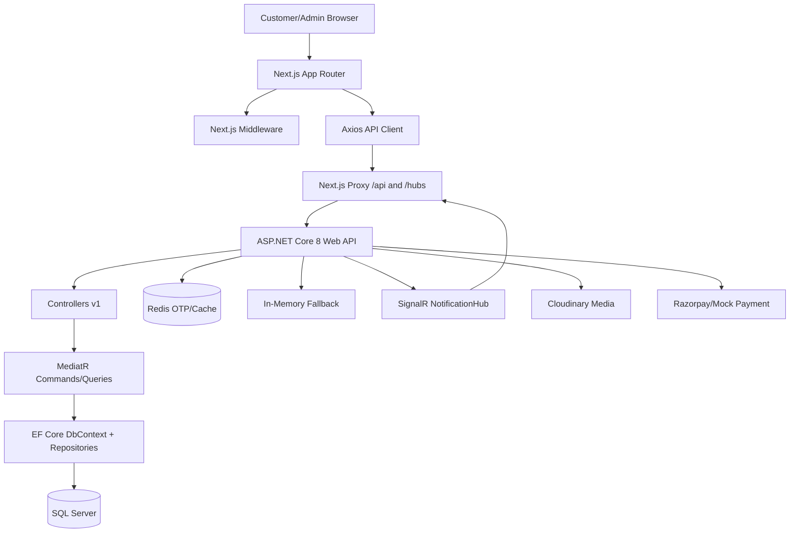
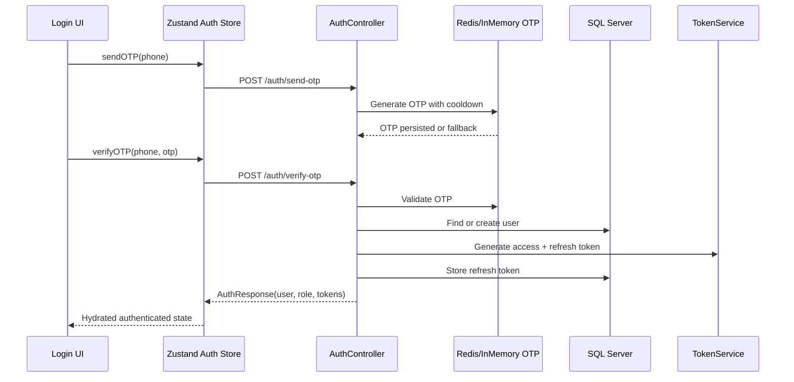
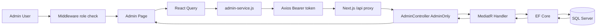
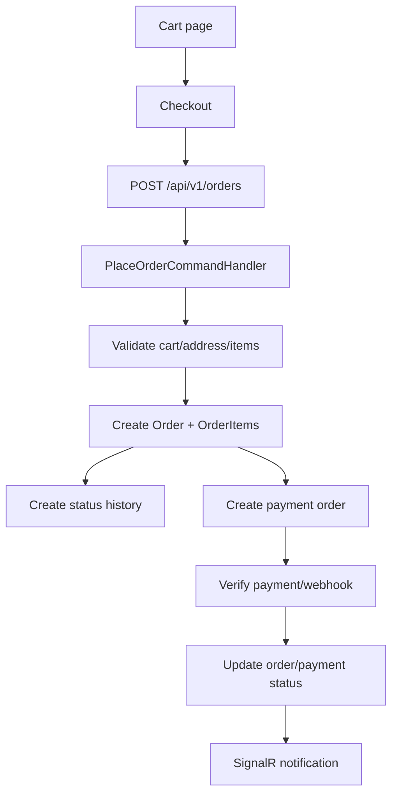
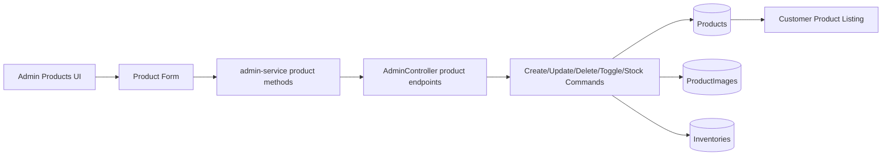
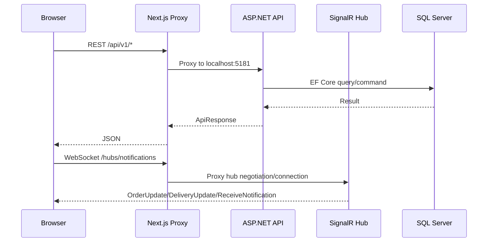

# FirstCry Clone E-Commerce Platform

**Enterprise Architecture, API, Runtime and Production Readiness Report**

Generated from repository: `C:\Personal\webdev\firstcry`

## 1. Project Overview

FirstCry Clone is a quick-commerce/e-commerce platform for parents and child-care shoppers, with a customer storefront, OTP-based authentication, cart and checkout flows, order management, payments, media upload, and an RBAC-protected admin panel. The architecture follows a SaaS-oriented layered model: a Next.js application communicates through a same-origin proxy to an ASP.NET Core API, which coordinates CQRS handlers, EF Core persistence, Redis-backed OTP/cache services, Cloudinary media, Razorpay payments, and SignalR notifications.

Target users include retail customers, guest shoppers completing onboarding after OTP registration, and operational admins managing products, orders, customers, storefront content, reviews, coupons, banners, and inventory.

## 2. Current Project Progress

| Area | Completion | Completed | Remaining / Risk |
| --- | --- | --- | --- |
| Frontend | 78% | Next App Router pages, admin pages, Zustand auth/cart stores, React Query integrations | Admin settings/storefront and some runtime verification remain |
| Backend | 84% | ASP.NET Core API, CQRS handlers, EF Core repositories, middleware, Swagger, SignalR hub | Transactions, indexes, audit logging, and production hardening remain |
| Authentication | 86% | OTP send/verify, JWT, refresh rotation, role claim, frontend hydration | Token storage and production security should be tightened |
| Admin Panel | 76% | Dashboard, products, orders, customers, categories, reviews, inventory, coupons, banners endpoints | Settings/storefront are mostly UI-local or incomplete |
| Database | 82% | Entities, migrations, soft delete filters, order/cart/product/review schemas | Index coverage, concurrency, and audit history need improvement |
| Runtime Stability | 70% | Redis fallback, startup DB tolerance, frontend retry/refresh interceptors | End-to-end browser and DB verification still needed |
| Infrastructure | 68% | Docker compose, SQL Server, Redis, Cloudinary, SignalR proxy, health endpoint | Monitoring, deployment pipeline, backup strategy remain |

### Module Completion Matrix

| Module | Status | Implemented Surface | Remaining Work |
| --- | --- | --- | --- |
| Auth + RBAC | Complete | OTP, JWT, refresh token rotation, admin role claim, frontend guard | Production token storage and CSRF remain |
| Catalog | Complete | Products, categories, brands, product images, featured/trending/related | Search relevance and image QA remain |
| Cart | Complete | Authenticated cart endpoints, guest merge, optimistic frontend store | Hydration flag and serialization watch remain |
| Checkout + Orders | Mostly complete | Place order, cancel, admin status update, status timeline | Transaction wrapping and stock reservation remain |
| Payments | Mostly complete | Razorpay order, verify, webhook, refund/capture endpoints | Production webhook secret/IP controls remain |
| Wishlist | Implemented | CRUD endpoints, service, store integration | UI polish/runtime pass remain |
| Reviews | Implemented | Create/update/delete user reviews, admin moderation endpoints | Moderation UX runtime pass remains |
| Admin Dashboard | Complete | Metrics, charts, tables, low-stock entry points | Analytics depth and caching tuning remain |
| Admin Products | Complete | CRUD, stock update, toggle, media integration path | Bulk tools and audit logging remain |
| Admin Orders | Complete | Paged listing, status update, order detail paths | Shipment automation and status rules remain |
| Admin Customers | Mostly complete | Customer list, role display, block/unblock | Customer detail/audit history remain |
| Admin Categories | Implemented | CRUD APIs and page flow | Runtime pass and hierarchy UX remain |
| Admin Inventory | Implemented | Inventory listing, alerts, stock update | Warehouse transaction QA remains |
| Admin Coupons | Implemented | CRUD APIs and page flow | Promotion rule validation remains |
| Admin Banners | Implemented | CRUD APIs and page flow | Storefront publishing validation remains |
| Notifications | Partial | SignalR hub, frontend hook, notification store | Notification APIs/UI and scale-out test remain |
| Uploads | Implemented | Cloudinary media service, upload/batch/product image endpoints | Production validation and file policy remain |
| Infrastructure | Partial | Docker, health checks, Redis fallback, Serilog logs | Monitoring, backups, CI/CD gates remain |

Completed modules: OTP auth, JWT generation, refresh token rotation, product catalog, categories, brands, cart, orders, payments, reviews, wishlist, admin dashboard/products/orders/customers, media upload, basic inventory, SignalR notification plumbing.

Partially completed modules: admin settings/storefront, coupons/banners runtime validation, advanced analytics, production search, real-time notification UX, production monitoring.

Blocked or risky modules: production security hardening, payment/webhook production secrets, DB indexes/concurrency, consistent end-to-end browser verification.

## 3. Complete API Documentation

| Module | Method | Endpoint | Auth | Admin | Request | Response | Status | Verification |
| --- | --- | --- | --- | --- | --- | --- | --- | --- |
| Auth | POST | /api/v1/auth/send-otp | No | No | { phoneNumber } | ApiResponse<bool> | Implemented | Code verified |
| Auth | POST | /api/v1/auth/verify-otp | No | No | { phoneNumber, otp } | AuthResponse with accessToken, refreshToken, user | Implemented | Code verified |
| Auth | POST | /api/v1/auth/refresh-token | No | No | { refreshToken } or cookie | AuthResponse | Implemented | Code verified |
| Auth | POST | /api/v1/auth/logout | Refresh token | No | { refreshToken } or cookie | ApiResponse | Implemented | Code verified |
| Auth | GET | /api/v1/auth/me | Yes | No | Bearer JWT | UserDto | Implemented | Code verified |
| Auth | PUT | /api/v1/auth/profile | Yes | No | UpdateProfileRequest | UserDto | Implemented | Code verified |
| Products | GET | /api/v1/products | No | No | Filters, paging | PagedListDto<ProductListDto> | Implemented | Code verified |
| Products | GET | /api/v1/products/featured | No | No | count | ProductListDto[] | Implemented | Code verified |
| Products | GET | /api/v1/products/trending | No | No | count | ProductListDto[] | Implemented | Code verified |
| Products | GET | /api/v1/products/{slug} | No | No | slug | ProductDetailDto | Implemented | Code verified |
| Products | GET | /api/v1/products/{slug}/related | No | No | slug, count | ProductListDto[] | Implemented | Code verified |
| Products | POST | /api/v1/products | Yes | Yes | CreateProductCommand | Product | Implemented | Needs runtime test |
| Products | PUT | /api/v1/products/{id}/stock | Yes | Yes | { newStock } | No content | Implemented | Needs runtime test |
| Categories | GET | /api/v1/categories | No | No | None | CategoryDto[] | Implemented | Code verified |
| Categories | GET | /api/v1/categories/featured | No | No | None | CategoryDto[] | Implemented | Code verified |
| Categories | GET | /api/v1/categories/{slug} | No | No | slug | CategoryDto | Implemented | Code verified |
| Brands | GET | /api/v1/brands | No | No | None | BrandDto[] | Implemented | Code verified |
| Cart | GET | /api/v1/cart | Yes | No | Bearer JWT | CartDto | Implemented | Code verified |
| Cart | POST | /api/v1/cart/items | Yes | No | { productId, quantity } | CartDto | Implemented | Code verified |
| Cart | PUT | /api/v1/cart/items/{productId} | Yes | No | { quantity } | CartDto | Implemented | Code verified |
| Cart | DELETE | /api/v1/cart/items/{productId} | Yes | No | productId | CartDto | Implemented | Code verified |
| Cart | DELETE | /api/v1/cart | Yes | No | None | ApiResponse | Implemented | Code verified |
| Cart | POST | /api/v1/cart/merge | No | No | { items, userId } | CartDto | Implemented | Code verified |
| Orders | POST | /api/v1/orders | Yes | No | PlaceOrderRequestDto | OrderDto | Implemented | Code verified |
| Orders | GET | /api/v1/orders | Yes | No | Paging | OrderDto[] | Implemented | Code verified |
| Orders | GET | /api/v1/orders/{id} | Yes | No | order id | OrderDetailDto | Implemented | Code verified |
| Orders | PUT | /api/v1/orders/{id}/cancel | Yes | No | order id | ApiResponse | Implemented | Code verified |
| Orders | PUT | /api/v1/orders/{id}/status | Yes | Yes | { status, note } | ApiResponse | Implemented | Code verified |
| Orders | GET | /api/v1/orders/admin/all | Yes | Yes | Search/status/page | PagedListDto<AdminOrderDto> | Implemented | Code verified |
| Wishlist | GET | /api/v1/wishlist | Yes | No | Bearer JWT | WishlistItemDto[] | Implemented | Code verified |
| Wishlist | POST | /api/v1/wishlist | Yes | No | { productId } | ApiResponse | Implemented | Code verified |
| Wishlist | PATCH | /api/v1/wishlist/{productId} | Yes | No | { note } | ApiResponse | Implemented | Code verified |
| Wishlist | DELETE | /api/v1/wishlist/{productId} | Yes | No | productId | ApiResponse | Implemented | Code verified |
| Payments | GET | /api/v1/payments/methods | No | No | None | PaymentMethodDto[] | Implemented | Needs runtime test |
| Payments | POST | /api/v1/payments/create-order | Yes | No | { orderId, amount } | RazorpayOrderResponse | Implemented | Needs runtime test |
| Payments | POST | /api/v1/payments/verify | Yes | No | Razorpay signature payload | ApiResponse | Implemented | Needs runtime test |
| Payments | POST | /api/v1/payments/webhook | Signature | No | Razorpay webhook | ApiResponse | Implemented | Needs production secret |
| Payments | GET | /api/v1/payments/status/{orderId} | Yes | No | orderId | PaymentStatusDto | Implemented | Needs runtime test |
| Payments | POST | /api/v1/payments/refund/{orderId} | Yes | Yes | RefundRequest | RefundResultDto | Implemented | Needs runtime test |
| Reviews | GET | /api/v1/reviews/product/{productId} | No | No | productId | ProductReviewDto[] | Implemented | Code verified |
| Reviews | POST | /api/v1/reviews | Yes | No | ReviewRequest | ProductReviewDto | Implemented | Code verified |
| Reviews | PUT | /api/v1/reviews/{id} | Yes | No | ReviewUpdateRequest | ApiResponse | Implemented | Code verified |
| Reviews | DELETE | /api/v1/reviews/{id} | Yes | No | id | ApiResponse | Implemented | Code verified |
| Search | GET | /api/v1/search | No | No | q, limit | SearchResultDto[] | Implemented | Basic implementation |
| Admin | GET | /api/v1/admin/dashboard | Yes | Yes | None | AdminDashboardDto | Implemented | Reported verified |
| Admin | GET | /api/v1/admin/products | Yes | Yes | Search/page | PagedListDto<AdminProductDto> | Implemented | Reported verified |
| Admin | POST | /api/v1/admin/products | Yes | Yes | CreateProductCommand | AdminProductDto | Implemented | Reported verified |
| Admin | PUT | /api/v1/admin/products/{id} | Yes | Yes | UpdateProductCommand | AdminProductDto | Implemented | Reported verified |
| Admin | DELETE | /api/v1/admin/products/{id} | Yes | Yes | id | ApiResponse | Implemented | Reported verified |
| Admin | PUT | /api/v1/admin/products/{id}/stock | Yes | Yes | { stockQuantity } | ApiResponse | Implemented | Reported verified |
| Admin | PATCH | /api/v1/admin/products/{id}/toggle | Yes | Yes | id | ApiResponse | Implemented | Reported verified |
| Admin | GET | /api/v1/admin/orders | Yes | Yes | Search/status/page | PagedListDto<AdminOrderDto> | Implemented | Reported verified |
| Admin | PUT | /api/v1/admin/orders/{id}/status | Yes | Yes | { status, note } | ApiResponse | Implemented | Reported verified |
| Admin | GET | /api/v1/admin/customers | Yes | Yes | Search/page | PagedListDto<AdminCustomerDto> | Implemented | Reported verified |
| Admin | PUT | /api/v1/admin/customers/{id}/block | Yes | Yes | { blocked } | ApiResponse | Implemented | Reported verified |
| Admin | GET/POST/PUT/DELETE | /api/v1/admin/categories | Yes | Yes | Admin category DTOs | AdminCategoryDto | Implemented | Needs runtime pass |
| Admin | GET/PATCH/DELETE | /api/v1/admin/reviews | Yes | Yes | Review status DTOs | AdminReviewDto | Implemented | Needs runtime pass |
| Admin | GET | /api/v1/admin/inventory | Yes | Yes | Search/page | AdminInventoryDto | Implemented | Needs runtime pass |
| Admin | GET/POST/PUT/DELETE | /api/v1/admin/coupons | Yes | Yes | Coupon DTOs | AdminCouponDto | Implemented | Needs runtime pass |
| Admin | GET/POST/PUT/DELETE | /api/v1/admin/banners | Yes | Yes | Banner DTOs | AdminBannerDto | Implemented | Needs runtime pass |
| Uploads | POST | /api/v1/media/upload | Yes | Yes | multipart/form-data | MediaUploadResponse | Implemented | Needs Cloudinary config |
| Uploads | POST | /api/v1/media/upload/batch | Yes | Yes | multipart/form-data[] | MediaUploadResponse[] | Implemented | Needs runtime test |
| Uploads | GET | /api/v1/media/product/{productId} | No | No | productId | ProductImageDto[] | Implemented | Code verified |
| Notifications | SignalR | /hubs/notifications | Yes | No | access_token query | OrderUpdate/DeliveryUpdate/etc. | Implemented | Needs live browser test |

## 4. Admin Panel System

| Module | Frontend Flow | Backend Controller | DB Tables | React Query / API | Zustand Usage | Progress | Runtime Status |
| --- | --- | --- | --- | --- | --- | --- | --- |
| Dashboard | /admin/dashboard | AdminController.GetDashboard | Orders, Products, Users, Inventory | getAdminDashboard / queryKeys.admin.dashboard | Auth store role only | Implemented | Reported verified |
| Products | /admin/products | AdminController product CRUD | Products, ProductImages, Categories, Brands, Inventory | get/create/update/delete/toggle/updateStock | Auth store token | Implemented | Reported verified |
| Orders | /admin/orders | AdminController orders + OrdersController admin | Orders, OrderItems, StatusHistory, Payments | getAdminOrders/updateAdminOrderStatus | Auth store token | Implemented | Reported verified |
| Customers | /admin/customers | AdminController customers | Users, Orders, Roles by User.Role | getAdminCustomers/setAdminCustomerBlocked | Auth store role | Implemented | Reported verified |
| Categories | /admin/categories | AdminController category CRUD | Categories | get/create/update/deleteAdminCategory | Auth store token | Implemented | Needs runtime pass |
| Inventory | /admin/inventory | AdminController inventory + InventoryController | Inventories, WarehouseInventories, Products | getAdminInventory/getAdminInventoryAlerts/updateStock | Auth store token | Implemented | Needs runtime pass |
| Reviews | /admin/reviews | AdminController review moderation | ProductReviews, Products, Users | getAdminReviews/updateAdminReviewStatus/deleteAdminReview | Auth store token | Implemented | Needs runtime pass |
| Coupons | /admin/coupons | AdminController coupon CRUD | Coupons | get/create/update/deleteAdminCoupon | Auth store token | Implemented | Needs runtime pass |
| Banners | /admin/banners | AdminController banner CRUD | Banners | get/create/update/deleteAdminBanner | Auth store token | Implemented | Needs runtime pass |
| Settings | /admin/settings | Local UI/settings only | No dedicated settings table confirmed | AdminForm local save | No shared Zustand | Partial | Not production-ready |
| Storefront | Header/admin menu + banners | Admin banner endpoints + media | Banners, ProductImages | admin-service + media-service | Auth role visibility | Partial | Needs runtime pass |

## 5. Authentication Flow

The authentication system is OTP-first. `AuthController` exposes send, verify, refresh, logout, current-user, and profile update endpoints. `AuthService` generates and validates OTPs through `IOtpService`, creates a new user when the phone number is first verified, and delegates token creation to `TokenService`. Refresh tokens are stored as an owned collection on the user and are rotated on refresh. The frontend stores session state in `auth-store.js`, mirrors token data to localStorage/cookies for middleware and API interceptors, and exposes role helpers such as `isAdmin` and `hasRole`.

Redis is the primary OTP/cache path when available. Startup probes Redis with short timeouts and falls back to singleton in-memory OTP storage plus in-memory cache when Redis is unavailable. This protects the login path from Redis outages in development and single-node deployments.

Admin access is validated twice: server-side through the `AdminOnly` authorization policy requiring `admin` or `Admin`, and frontend-side through Next middleware parsing the JWT role claim and redirecting non-admin users away from `/admin/*`.

## 6. Database Architecture

| Table / Entity | Purpose | Key Fields | Relationships |
| --- | --- | --- | --- |
| Users | Customer/admin identities with OTP phone login | PhoneNumber, Role, IsGuest, ProfileCompleted, RefreshTokens | Addresses, WishlistItems, Reviews; orders reference user separately |
| RefreshToken owned collection | JWT refresh rotation state | Token, Expires, Created, Revoked, ReplacedByToken | Owned by User; not standalone DbSet |
| Products | Catalog SKU/product data | Slug, pricing, stock, images, tags, status | Category, Brand, ProductImages, Reviews, CartItems, OrderItems |
| Categories | Hierarchical catalog taxonomy | Slug, parent category, display order, IsActive | Products and child categories |
| Brands | Product brand metadata | Name, Slug, ImageUrl, IsActive | Products |
| Carts / CartItems | Authenticated cart persistence | UserId, ProductId, Quantity | User and Product |
| Orders / OrderItems | Order placement and fulfillment lifecycle | OrderNumber, UserId, totals, status, shipping address | User, products via order items, payment, shipment/status history |
| ProductReviews | Product rating and moderation | UserId, ProductId, Rating, Status | User and Product |
| WishlistItems | Saved products | UserId, ProductId, Note | User and Product |
| Payments / Transactions / Refunds | Razorpay or mock payment flow | OrderId, Razorpay ids, status, amount | Order |
| Inventory / Warehouses | Stock tracking and warehouse operations | ProductId, quantity, reorder level, transfers | Products and warehouses |
| Notifications | Real-time and persisted user notifications | UserId, Title, Message, Type, IsRead | User; delivered via SignalR |
| Coupons / Banners | Admin storefront operations | Code, discount, validity; banner content | Storefront/admin modules |

EF Core flow: controllers call MediatR handlers or services; handlers use `ApplicationDbContext`, repositories, and unit of work patterns; migrations keep SQL Server aligned; global query filters exclude soft-deleted auditable entities. Audit columns are inherited from `AuditableEntity` (`CreatedBy`, `UpdatedBy`, `IsDeleted`, `DeletedAt`) while base identity fields come from `BaseEntity` (`Id`, `CreatedAt`, `UpdatedAt`).

## 7. Frontend to Backend Workflow

Request lifecycle: user action -> React component -> React Query hook or Zustand action -> service/API helper -> Axios client -> Next.js proxy rewrite -> ASP.NET controller -> MediatR handler/service -> EF Core -> SQL Server -> ApiResponse -> Axios unwrap -> React Query cache/Zustand state -> UI render.

Examples:

- Products: product listing calls `productsApi.getProducts`, hits `/api/v1/products`, resolves `GetProductsQuery`, loads products/categories/brands through EF Core, and renders catalog cards.
- Orders: checkout posts `PlaceOrderRequestDto` to `/api/v1/orders`, creates order records and status history, then payment verification updates fulfillment state.
- Admin dashboard: `/admin/dashboard` page uses React Query and `getAdminDashboard`, which hits `AdminController.GetDashboard`, aggregates totals and recent operational data, and renders cards/charts/tables.
- Cart: cart store performs optimistic local changes, calls cart API endpoints, and rolls back or refreshes on server error.
- Checkout: authenticated cart and selected address flow into order placement; payment methods and Razorpay verification complete the transaction.

## 8. System Architecture Diagrams

### System Architecture



### Authentication Flow



### Admin Workflow



### Order Workflow



### Product Workflow



### Runtime Communication



## 8A. System Wireframes

### Customer Storefront

```text
+--------------------------------------------------------------------------------+
| Header: logo | category nav | search bar | account menu | cart                 |
+--------------------------------------------------------------------------------+
| Promo/banner rail                                                               |
+-------------------------+------------------------------------------------------+
| Category filters        | Product grid: cards, price, stock, add-to-cart       |
| Brand/price/age filters | Pagination / load more                               |
+-------------------------+------------------------------------------------------+
| Footer: support, policies, app links                                           |
+--------------------------------------------------------------------------------+
```

### Admin Dashboard

```text
+------------------+-------------------------------------------------------------+
| Sidebar          | Header: search, notifications, admin profile                |
| - Dashboard      +-------------------------------------------------------------+
| - Products       | KPI cards: revenue | orders | customers | low stock         |
| - Orders         +-------------------------------------------------------------+
| - Customers      | Revenue chart                 | Recent orders table         |
| - Inventory      +-------------------------------+-----------------------------+
| - Coupons        | Low stock alerts              | Operational actions         |
+------------------+-------------------------------------------------------------+
```

### Checkout

```text
+--------------------------------------------------------------------------------+
| Checkout steps: Cart -> Address -> Payment -> Confirmation                     |
+--------------------------------------+-----------------------------------------+
| Address selector / form              | Order summary                           |
| Payment method selector              | Items, subtotal, shipping, discounts    |
| Razorpay/mock payment action         | Place order CTA                         |
+--------------------------------------+-----------------------------------------+
```

### OTP Authentication

```text
+--------------------------------------+-----------------------------------------+
| Login / Register                     | Verify OTP                              |
+--------------------------------------+-----------------------------------------+
| Phone number input                   | 6 digit OTP input                       |
| Send OTP CTA                         | Resend timer + verify CTA               |
| Validation and cooldown messages     | Auth store persists user/tokens         |
+--------------------------------------+-----------------------------------------+
| Backend: /auth/send-otp -> Redis/InMemory -> /auth/verify-otp -> JWT           |
+--------------------------------------------------------------------------------+
```

### Admin Products

```text
+------------------+-------------------------------------------------------------+
| Sidebar          | Products toolbar: search | filters | add product            |
+------------------+-------------------------------------------------------------+
| Product modules  | Product table: image | name | category | price | stock      |
|                  | Row actions: edit | stock | toggle | delete                |
+------------------+-------------------------------------------------------------+
| Modal/drawer: product form, image upload, category/brand selection             |
+--------------------------------------------------------------------------------+
```

### Admin Orders

```text
+------------------+-------------------------------------------------------------+
| Sidebar          | Orders toolbar: search | status filter | pagination          |
+------------------+-------------------------------------------------------------+
| Order modules    | Orders table: order no | customer | total | status | date    |
|                  | Detail panel: items, address, payment, status timeline      |
+------------------+-------------------------------------------------------------+
| Admin action: update fulfillment status -> API -> DB -> optional SignalR push   |
+--------------------------------------------------------------------------------+
```

## 9. Debugging and Audit Report

| Issue | Root Cause | Affected Files | Fix / Control | Status |
| --- | --- | --- | --- | --- |
| Redis timeout/unavailable | Redis startup probe may fail or service may be down | DependencyInjection.cs, RedisOtpService.cs, Program.cs | Fallback to InMemoryOtpService/InMemoryCacheService; SignalR Redis backplane guarded | Mitigated |
| JWT role mismatch | Frontend and middleware must read both role and legacy claim URI | TokenService.cs, middleware.js, auth-store.js | JWT bearer RoleClaimType set to role; frontend normalizes role case | Mitigated |
| SQL schema drift | Migrations adjusted after entity shape changes | Infrastructure/Migrations/* | Repair migrations for order audit/status history and admin entities | In progress |
| IsDeleted column mismatch | Global soft delete filters require IsDeleted columns on auditable entities | ApplicationDbContext.cs, migrations | Global query filter plus repair migrations | Mitigated |
| React Query missing integration | Admin pages historically needed direct service calls wired to cache keys | admin pages, admin-service.js | Admin pages use queryKeys and admin-service methods | Mostly mitigated |
| Response shape mismatches | Some APIs return ApiResponse<T>; services unwrap response.data.data || response.data | admin-service.js, error-handler.js | Central unwrap helper applied | Mitigated |
| Cart serialization cycle | Cart responses can include navigation cycles if entities are returned directly | CartController/CartService | DTO shaping and frontend normalization expected | Needs runtime watch |
| Transaction retry issue | SQL retry strategy plus manual transactions can conflict without execution strategy | Order/payment command handlers | Documented as remaining hardening task | Open |
| Status history key issue | OrderStatusHistory repair migration indicates schema/key drift | 20260514202000_RepairOrderStatusHistoryTable.cs | Repair migration added | Mitigated |
| Admin debug logging | Admin service currently logs token and role to console | frontend/src/services/admin-service.js | Useful in dev; remove or gate before production | Open |

## 10. Current Verified Endpoints

| Endpoint | Frontend | Backend | DB | Browser | Runtime Status |
| --- | --- | --- | --- | --- | --- |
| GET /api/v1/admin/dashboard | Yes | Yes | Partial | Reported | Runtime verified in project notes |
| GET /api/v1/admin/products | Yes | Yes | Partial | Reported | Runtime verified in project notes |
| GET /api/v1/admin/orders | Yes | Yes | Partial | Reported | Runtime verified in project notes |
| GET /api/v1/admin/customers | Yes | Yes | Partial | Reported | Runtime verified in project notes |
| PUT /api/v1/admin/customers/{id}/block | Yes | Yes | Partial | Reported | Runtime verified in project notes |
| POST /api/v1/auth/send-otp | Yes | Yes | OTP store | Not rerun in this pass | Code verified; runtime should be rerun |
| POST /api/v1/auth/verify-otp | Yes | Yes | Users + tokens | Not rerun in this pass | Code verified; runtime should be rerun |
| GET /api/v1/categories | Yes | Yes | Categories | Not rerun in this pass | Code verified |
| GET /api/v1/products | Yes | Yes | Products | Not rerun in this pass | Code verified |
| GET /api/v1/cart | Yes | Yes | Cart | Not rerun in this pass | Needs authenticated runtime pass |
| POST /api/v1/orders | Yes | Yes | Orders | Not rerun in this pass | Needs checkout runtime pass |
| SignalR /hubs/notifications | Hook present | Hub mapped | Notifications | Not rerun in this pass | Needs live socket test |

## 11. Remaining Work

Pending admin endpoints/runtime audits: coupons, banners, inventory adjustments, category CRUD, review moderation, media upload, shipment/warehouse flows.

Pending frontend hooks/integration: full notification list APIs, storefront banner management, admin settings persistence, wishlist/review polish, cart hydration flag, production-safe admin logging.

Production tasks: environment-based secrets, HTTPS/HSTS, CSP, CSRF strategy, Razorpay webhook secret enforcement, DB indexes, transaction wrapping, concurrency controls, monitoring, alerting, backups, CI/CD gates, container hardening.

Optimization tasks: query profiling, pagination limits, image optimization budgets, Redis production config, CDN strategy, cache invalidation rules, SignalR scale-out validation.

## 12. Production Readiness

| Checklist | Required Controls | Current State |
| --- | --- | --- |
| Security | Secret management, CSP, CSRF, HTTPS/HSTS, webhook validation, token hardening | Partial |
| Performance | Indexes, pagination caps, query profiling, image budgets | Partial |
| Caching | Redis production, cache invalidation, fallback monitoring | Partial |
| Deployment | Environment separation, CI/CD, container health checks, rollback plan | Partial |
| Scalability | SignalR backplane, stateless API, DB scale plan, CDN | Early-stage |
| Monitoring | Structured logs, metrics, tracing, alerting, uptime checks | Missing/partial |
| Data Safety | Backups, restore drills, audit logs, admin action history | Missing/partial |

## Engineering Audit Summary

The project has strong engineering foundations: layered backend architecture, CQRS/MediatR, EF Core persistence, modern Next.js frontend state management, OTP authentication, refresh-token rotation, admin RBAC, and a practical same-origin proxy. The remaining work is primarily production hardening rather than core architecture replacement. Highest-priority improvements are security hardening, database performance/indexing, transaction safety, payment/webhook production controls, runtime verification, and operational observability.