# FirstCry Clone E-Commerce Platform

**Full System Wireframe & Workflow Architecture**

Repository: `C:\Personal\webdev\firstcry`

## 1. Project Overview

FirstCry Clone is a quick-commerce and e-commerce platform with customer storefront workflows, OTP authentication, cart/checkout, order processing, payment integration, product catalog management, media upload, SignalR notifications, and an RBAC-protected admin panel. The system is designed as a scalable SaaS-style platform with a Next.js frontend and ASP.NET Core API backend.

Engineering goals: clear separation of frontend, application, domain, infrastructure, and persistence concerns; reusable API communication; resilient OTP/cache fallback; and admin-friendly operational workflows.

Scalability goals: stateless API replicas, Redis-backed shared cache/SignalR backplane, SQL Server persistence, CDN-backed static/media delivery, and observability-ready runtime flows.

## 2. Complete System Architecture

```text
+--------------------------------------------------------------------------------+
| Browser: customer storefront / admin console                                   |
+--------------------------------------------------------------------------------+
| Next.js App Router: layouts, route groups, middleware, server/client components |
+--------------------------------------------------------------------------------+
| State: React Query server cache | Zustand auth/cart/ui/checkout stores         |
+--------------------------------------------------------------------------------+
| API client: Axios, JWT attachment, retries, refresh-token replay               |
+--------------------------------------------------------------------------------+
| Next.js Proxy: /api/v1/* -> ASP.NET API | /hubs/* -> SignalR                   |
+--------------------------------------------------------------------------------+
| ASP.NET Core: middleware -> controllers -> MediatR -> EF Core/services         |
+--------------------------------------------------------------------------------+
| Data/infra: SQL Server | Redis | Cloudinary | SignalR | payment provider       |
+--------------------------------------------------------------------------------+
```

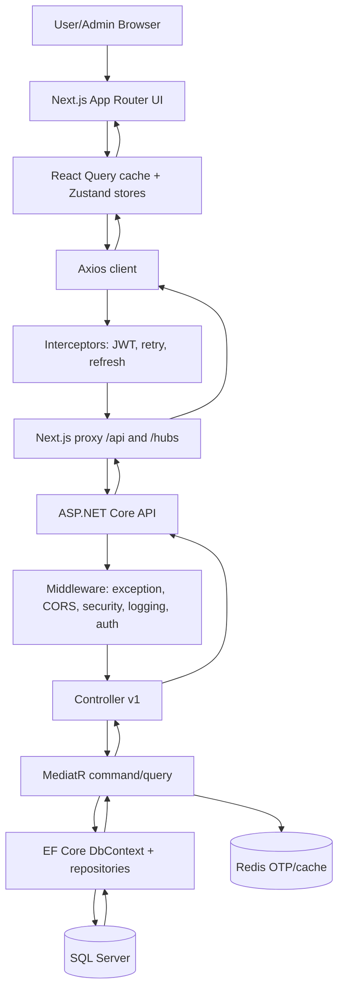

## 3. Frontend Architecture Wireframe

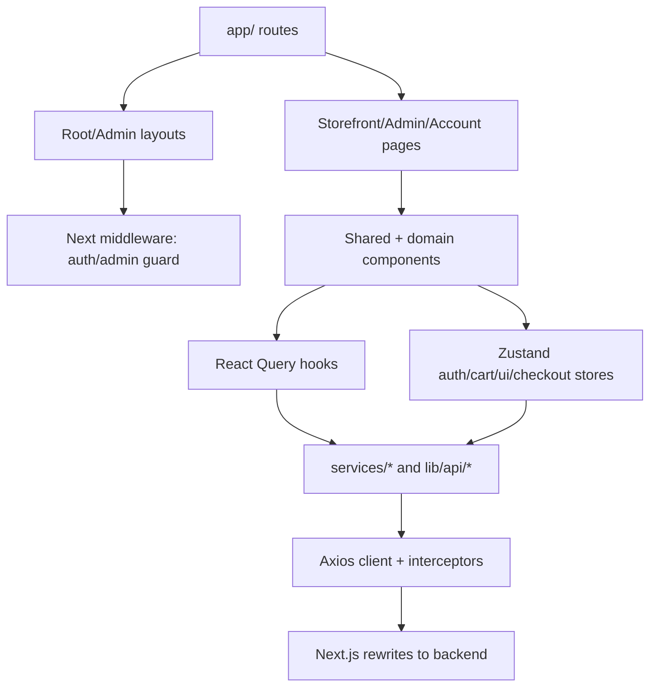

Frontend data moves from App Router pages and layouts into domain components, React Query hooks, Zustand stores, service files, Axios, and finally the Next.js proxy. Middleware protects authenticated and admin routes by parsing JWT/cookie state. Zustand handles long-lived client state such as auth, cart, UI, checkout, account, and notifications; React Query owns server-state caching, refetch, mutation invalidation, and loading/error states.

## 4. Backend Architecture Wireframe

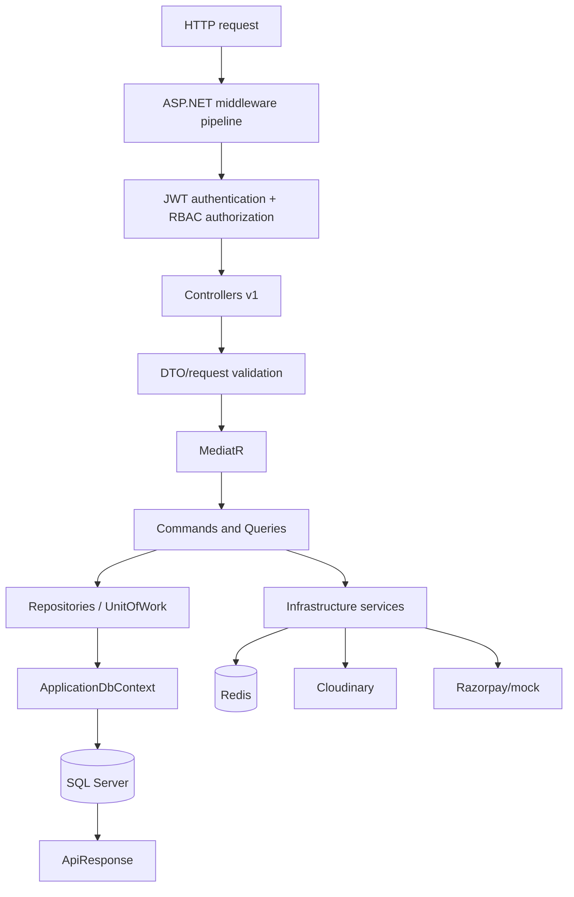

The API follows a Clean Architecture/CQRS shape: controllers receive versioned REST requests, DTOs carry request/response contracts, MediatR dispatches commands and queries, handlers coordinate repositories/services, EF Core persists domain state, and middleware standardizes exceptions, security headers, logging, CORS, authentication, authorization, and rate limiting.

## 5. Authentication Flow Wireframe

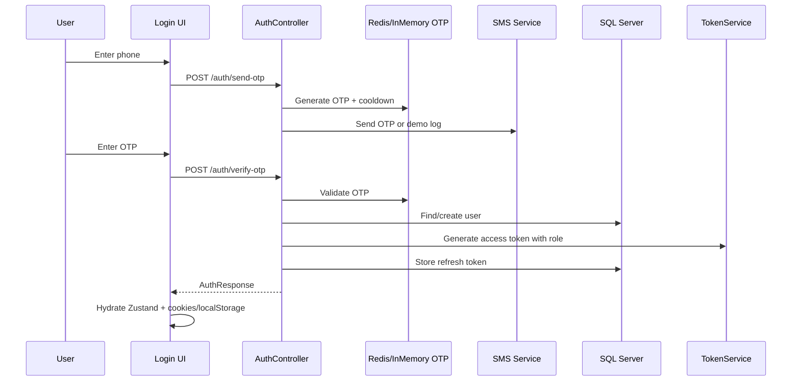

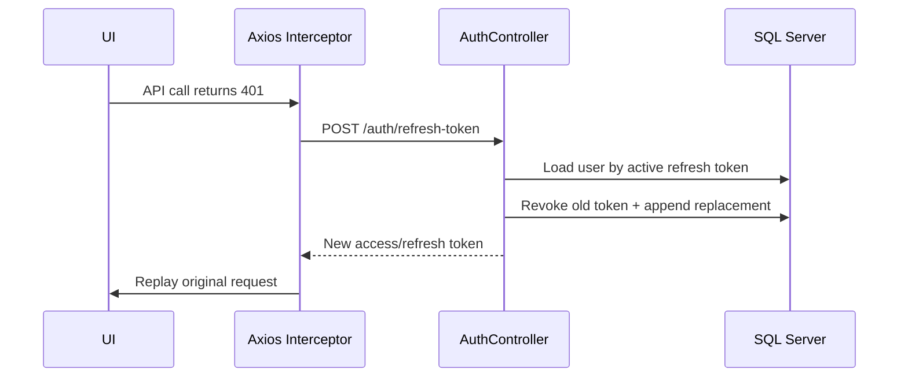

Redis is preferred for OTP storage and cooldowns. When Redis is unavailable, dependency injection registers in-memory OTP/cache fallbacks so development and single-node runtime login can continue. Admin RBAC is enforced by the backend AdminOnly policy and by frontend middleware/admin visibility logic.

## 6. Admin Panel Wireframe

```text
+------------------+-------------------------------------------------------------+
| Sidebar          | Header: search, notifications, admin profile                |
| Dashboard        +-------------------------------------------------------------+
| Products         | KPI cards / module toolbar                                  |
| Orders           +-------------------------------------------------------------+
| Customers        | Primary table/list view                                      |
| Categories       +-------------------------------------------------------------+
| Inventory        | Detail drawer/modal: CRUD form, status update, review action |
| Reviews          +-------------------------------------------------------------+
| Coupons/Banners  | Pagination, filters, mutation feedback                      |
+------------------+-------------------------------------------------------------+
```

| Module | Page | Backend Flow | DB Interaction | React Query Lifecycle | Runtime Status |
| --- | --- | --- | --- | --- | --- |
| Dashboard | /admin/dashboard | GET /api/v1/admin/dashboard | Orders, Products, Users, Inventory | React Query load -> metric cards/charts | Stable, reported verified |
| Products | /admin/products | GET/POST/PUT/DELETE /api/v1/admin/products | Products, Images, Categories, Brands, Inventory | CRUD mutation -> invalidate product/admin queries | Stable, reported verified |
| Orders | /admin/orders | GET /admin/orders; PUT /admin/orders/{id}/status | Orders, OrderItems, Payments, StatusHistory | Status mutation -> invalidate orders/dashboard | Stable, reported verified |
| Customers | /admin/customers | GET /admin/customers; PUT /customers/{id}/block | Users, Orders | Block/unblock mutation -> refresh customers | Stable, reported verified |
| Categories | /admin/categories | GET/POST/PUT/DELETE /admin/categories | Categories | CRUD mutation -> refresh category lists | Implemented, needs runtime pass |
| Inventory | /admin/inventory | GET /admin/inventory; GET /alerts; stock update | Inventories, WarehouseInventories, Products | Stock mutation -> refresh inventory/product lists | Implemented, needs runtime pass |
| Reviews | /admin/reviews | GET/PATCH/DELETE /admin/reviews | ProductReviews, Products, Users | Moderation mutation -> refresh reviews | Implemented, needs runtime pass |
| Coupons | /admin/coupons | GET/POST/PUT/DELETE /admin/coupons | Coupons | CRUD mutation -> refresh coupon list | Implemented, needs runtime pass |
| Banners | /admin/banners | GET/POST/PUT/DELETE /admin/banners | Banners, Media | CRUD mutation -> refresh storefront assets | Implemented, needs runtime pass |
| Settings | /admin/settings | No durable settings endpoint confirmed | Future Settings table | Local admin form behavior | Partial |
| Storefront | Header/banner/product surfaces | Admin banners + media + products APIs | Banners, Products, ProductImages | Publishing flow through admin CRUD | Partial |

## 7. Product Workflow

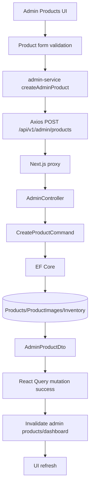

Product browsing uses public catalog endpoints through product API helpers. Product search uses the `/api/v1/search` endpoint and search UI components. Inventory updates flow through admin stock endpoints and invalidate admin/product query caches after successful mutation.

## 8. Cart & Checkout Workflow

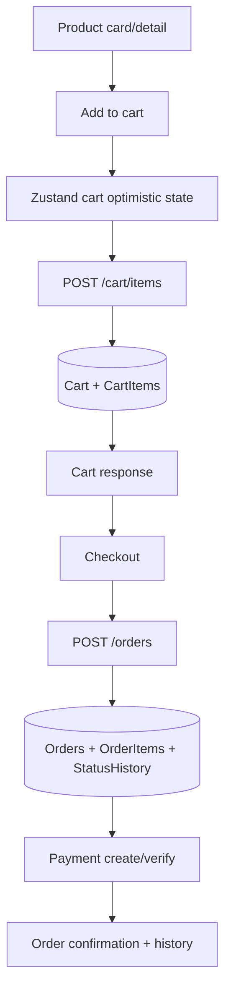

Cart state is managed with Zustand for optimistic UI responsiveness and persisted through backend cart endpoints for authenticated users. Guest cart data is merged after OTP login. DTO mapping and response unwrapping keep the frontend away from EF navigation cycles.

## 9. Order Management Workflow

```mermaid
graph TD
  USER[User checkout] --> PLACE[PlaceOrderCommand]
  PLACE --> ORDER[(Orders)]
  PLACE --> ITEMS[(OrderItems)]
  PLACE --> HIST[(StatusHistory)]
  ORDER --> PAY[Payment lifecycle]
  ADMIN[Admin Orders UI] --> STATUS[Update status]
  STATUS --> API[PUT /admin/orders/{id}/status]
  API --> HIST
  API --> NOTIFY[SignalR notification]
  NOTIFY --> USER
```

Order creation creates order records, order items, shipping address snapshots, payment records, and status history. Admin status updates append status history and can trigger real-time notifications. Inventory reduction and admin audit logging should be hardened before production.

## 10. Database Architecture

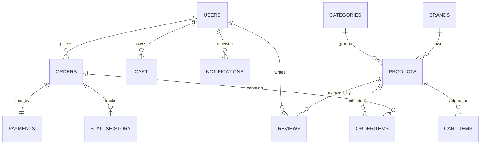

| Table | Key Fields | Relationships |
| --- | --- | --- |
| Users | Id, PhoneNumber, Name, Email, Role, IsGuest, ProfileCompleted, IsDeleted | 1:N Addresses, WishlistItems, Reviews, Orders, Notifications; owns RefreshTokens |
| Roles | Role represented by User.Role plus JWT role claim | AdminOnly policy uses role claim; no separate role table confirmed |
| Products | Id, Slug, Name, Price, StockQuantity, CategoryId, BrandId, IsActive, IsDeleted | N:1 Category, N:1 Brand, 1:N ProductImages, Reviews, CartItems, OrderItems |
| Categories | Id, Name, Slug, ParentCategoryId, DisplayOrder, IsActive | Self hierarchy, 1:N Products |
| Orders | Id, OrderNumber, UserId, Status, totals, ShippingAddress, CreatedAt | 1:N OrderItems, 1:1 Payment, 1:N StatusHistory |
| OrderItems | OrderId, ProductId, Quantity, UnitPrice, Total | N:1 Order, N:1 Product snapshot data |
| Cart | Id, UserId, CreatedAt, UpdatedAt | 1:N CartItems, N:1 User |
| CartItems | CartId, ProductId, Quantity | N:1 Cart, N:1 Product |
| Reviews | UserId, ProductId, Rating, Title, Comment, Status | N:1 User, N:1 Product |
| Coupons | Code, DiscountType, Amount, Validity, UsageLimit, IsActive | Used by checkout/promotion rules |
| Notifications | UserId, Title, Message, Type, IsRead, CreatedAt | N:1 User, delivered through SignalR |
| Banners | Title, ImageUrl, TargetUrl, DisplayOrder, IsActive | Admin-managed storefront content |

## 11. API Communication Flow

Frontend request -> Axios -> interceptors -> JWT attachment -> Next.js proxy -> backend middleware -> authorization -> controller -> MediatR handler -> database/service -> ApiResponse<T> -> unwrap/error handling -> React Query/Zustand -> render. Axios retry handles transient network errors; 401 responses trigger refresh-token replay where possible.

### Workflow Interaction Matrix

| Workflow | Trigger | System Path | Result |
| --- | --- | --- | --- |
| Product browse | Customer opens catalog or search | productsApi/search -> public controllers -> MediatR queries -> EF Core | Product grid/detail, cache populated |
| Product create | Admin submits product form | admin-service -> AdminController -> CreateProductCommand -> EF Core insert | Admin table refreshed, product available to storefront |
| Inventory update | Admin adjusts stock | PUT stock endpoint -> command/service -> product/inventory tables | Stock count refreshed and low-stock alerts recalculated |
| Add to cart | Customer clicks add-to-cart | Zustand optimistic update -> POST /cart/items -> CartService/EF | Cart drawer/page reflects persisted cart |
| Guest cart merge | Guest logs in with OTP | auth-store verifies OTP -> cart.merge -> CartController merge endpoint | Guest items attached to authenticated user |
| Checkout | User confirms address/payment | POST /orders -> order handler -> payment service -> status history | Order confirmation and order history updated |
| Admin order status | Admin changes fulfillment status | PUT /admin/orders/{id}/status -> status handler -> history append | Admin table refresh and optional notification |
| Token refresh | Access token expires | Axios 401 interceptor -> /auth/refresh-token -> rotate refresh token | Original request replayed without redirect loop |
| Realtime notification | Order/delivery event emitted | API service -> SignalR hub -> Next /hubs proxy -> browser hook | Notification store receives event |

### State Management Architecture

| Layer | State / Responsibility | Used By |
| --- | --- | --- |
| Zustand auth-store | User, token, refresh token, hydration flag, role helpers | Login, admin guard, logout, token refresh |
| Zustand cart-store | Items, totals, guest cart, optimistic mutations | Cart drawer/page, checkout, merge after login |
| Zustand checkout-store | Selected address, payment mode, checkout progress | Checkout pages and order creation |
| Zustand UI/notification stores | Drawer state, toasts, realtime notifications | Global UX feedback and SignalR events |
| React Query | Server-state cache, loading/error status, mutation invalidation | Admin lists, dashboard, products, orders, categories |
| Axios interceptors | JWT attachment, retry policy, 401 refresh replay | All protected API calls and session recovery |

## 12. Real-Time & Infrastructure Flow

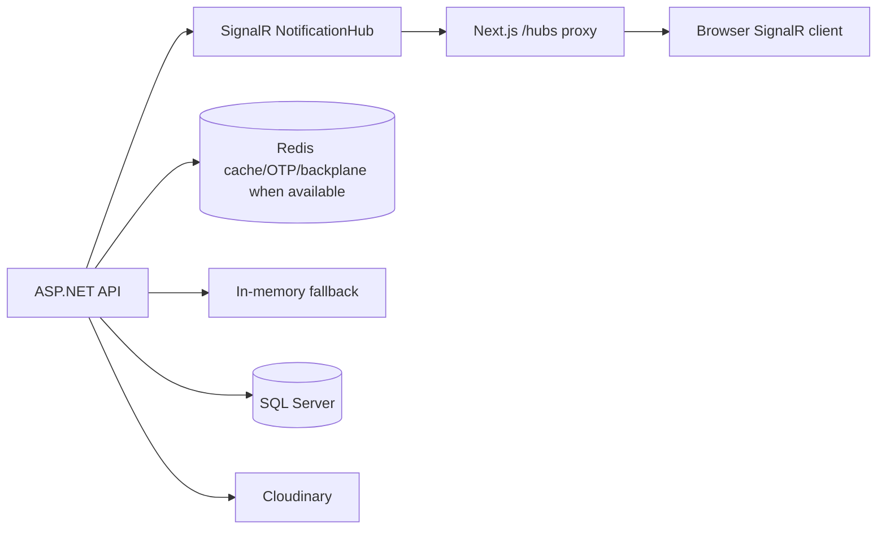

SignalR enables live notifications for order and delivery events. Redis supports OTP, cache, and optional backplane behavior. Cloudinary handles product/admin media assets. SQL Server remains the source of truth for commerce state.

## 13. Debugging & Runtime Audit Flow

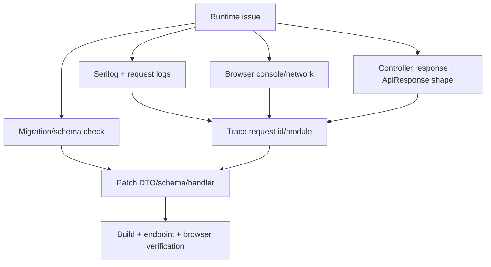

| Runtime Layer | Audit Surface | Verification Method |
| --- | --- | --- |
| Browser | Network tab, console, hydration state, route redirects | Verify proxy path, auth cookie/token, React Query state, console errors |
| Next.js proxy | Rewrites `/api/:path*` and `/hubs/:path*` | Confirm backend target, status code, CORS/cookie behavior |
| API middleware | Exception/security/request logging/auth/rate limiting | Check status code, auth challenge, policy failure, trace logs |
| Controller | Route binding and DTO input | Confirm endpoint path, payload shape, ApiResponse wrapper |
| MediatR handler | Command/query business execution | Confirm validation, repository/service calls, transaction boundary |
| EF Core | DbContext query/command | Check SQL schema, migrations, includes, soft delete filter, FK constraints |
| Infrastructure | Redis, Cloudinary, SignalR, payment provider | Validate fallback, secrets, timeout behavior, external response shape |

Runtime debugging should trace a request from browser network logs, through proxy paths, controller logs, ApiResponse shape, handler execution, EF SQL, and migrations. Schema drift is handled through EF migrations and repair migrations; DTO-safe serialization avoids returning domain graphs directly.

## 14. Deployment Architecture

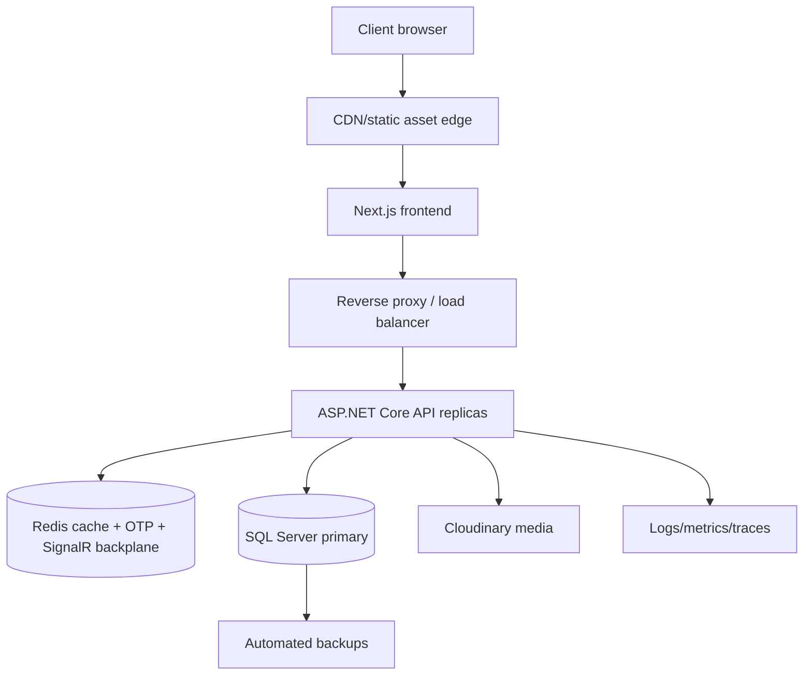

Production should separate development, staging, and production environments; place the frontend behind a CDN; run API replicas behind a reverse proxy/load balancer; use Redis for shared cache/backplane; store SQL backups; ship logs/metrics/traces; and serve media through Cloudinary/CDN.

## 15. Current Project Progress

| Area | Completion | Runtime-Stable Surface | Pending Work |
| --- | --- | --- | --- |
| Frontend | 78% | App Router pages, admin layouts, auth/cart stores, proxy API calls | Hydration consistency, notification UI, admin settings/storefront polish |
| Backend | 84% | Controllers, MediatR handlers, EF Core, JWT, RBAC, middleware | Transactions, index coverage, audit logging, production secrets |
| Authentication | 86% | OTP, Redis/in-memory fallback, JWT, refresh rotation, admin role checks | CSRF strategy, token storage hardening, production lockout policy |
| Admin Panel | 76% | Dashboard, products, orders, customers, categories, reviews, inventory, coupons, banners | Runtime pass for every CRUD module and settings persistence |
| Database | 82% | Entities, migrations, soft delete, order/cart/product/review schemas | Indexes, concurrency tokens, backup/restore strategy |
| Infrastructure | 68% | Docker, SQL Server, Redis, SignalR, Cloudinary, Next proxy, health | Monitoring, alerting, CDN, deployment pipeline |

### Verified / Audited Runtime Matrix

| Module | Audited Surface | Status | Next Verification |
| --- | --- | --- | --- |
| Admin dashboard | Frontend + backend | Reported verified | Add browser smoke test |
| Admin products | Frontend + backend | Reported verified | Add create/edit/delete e2e test |
| Admin orders | Frontend + backend | Reported verified | Add status transition test |
| Admin customers | Frontend + backend | Reported verified | Add block/unblock assertion |
| OTP auth | Code verified | Needs rerun | Verify send, verify, refresh, logout |
| Categories | Code verified | Needs runtime pass | Check public + admin CRUD |
| Cart | Code verified | Needs authenticated runtime pass | Check add/update/remove/merge |
| Checkout/orders | Code verified | Needs full flow pass | Check order + payment + history |
| SignalR | Hook and hub present | Needs live socket test | Check order notification path |

## Engineering Conclusion

The project already has a strong architecture foundation: Next.js frontend composition, service-based API communication, Zustand and React Query state layers, ASP.NET Core controller/CQRS backend, EF Core persistence, Redis fallback strategy, JWT/RBAC authorization, and admin operational workflows. The next engineering step is production hardening: transaction safety, DB indexes, monitoring, secrets, webhook enforcement, e2e runtime validation, and deployment automation.